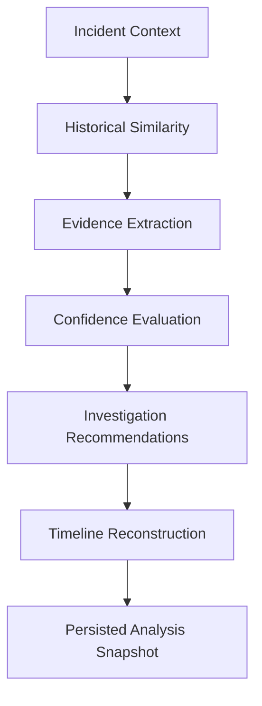
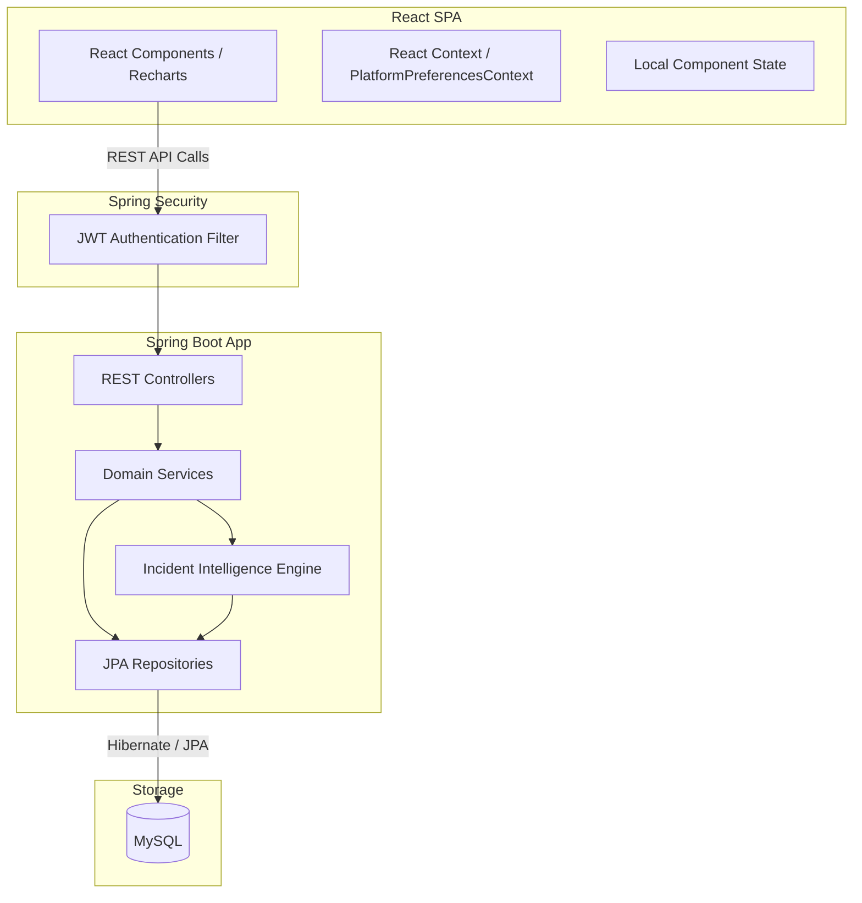
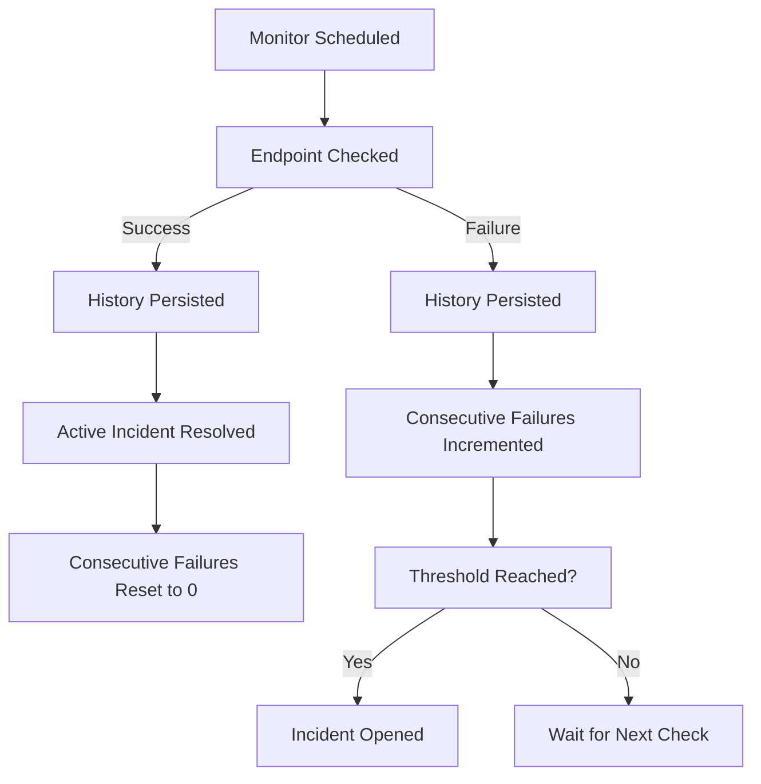

# ARGUS

### Infrastructure Monitoring and Deterministic Incident Intelligence Platform

ARGUS is a full-stack infrastructure monitoring and incident intelligence platform. Built with Java, Spring Boot, React, and MySQL, the application enables operators to monitor the availability, response characteristics, and operational health of HTTP/HTTPS endpoints. 

Unlike traditional monitoring systems that simply report whether a service is up or down, ARGUS organizes observed failure evidence, compares current incidents with historical patterns, calculates conservative confidence scores, generates structured investigation recommendations, and reconstructs chronological incident timelines.

While ARGUS offers an optional AI Provider integration to enrich incident analyses with narrative summaries, the core Incident Intelligence system is fully deterministic and evidence-based. If an external AI provider fails or is unconfigured, the deterministic analysis pipeline continues to function without interruption.

---

## Why ARGUS

Traditional monitoring tools excel at detecting when an endpoint becomes unhealthy, but they leave the subsequent investigation entirely to human operators. When an outage occurs, operators must manually collect logs, correlate response codes, compare the incident with past failures, and reconstruct the sequence of events.

ARGUS structures incident investigation context, reduces manual correlation requirements, and minimizes cognitive load during high-severity events by capturing, structuring, and preserving the context surrounding every incident. It compares current failure signatures with historical data to identify recurring patterns, evaluates evidence to assign a confidence level, and provides actionable recommendations to guide resolution teams. By establishing a standard, deterministic structure for incident data, ARGUS helps operators make sense of failures quickly and systematically.

---

## Core Capabilities

* **HTTP/HTTPS Endpoint Monitoring**: Track availability, response times, and status codes of target URLs.
* **Configurable Execution**: Fine-tune monitor check intervals (minimum 60s) and failure thresholds per monitor.
* **Incident Lifecycle Management**: Automatically open, track, and resolve incidents based on configured failure status.
* **Deterministic Incident Intelligence**: Extract signatures from failures and evaluate them against historical records.
* **Structured Evidence Extraction**: Assess exact network/HTTP characteristics (e.g., status codes, response times, timeout indicators).
* **Historical Similarity Analysis**: Match current failures against historical incidents to determine if a known pattern has reoccurred.
* **Confidence Evaluation**: Compute a conservative confidence score for the analysis based on available evidence and historical overlap.
* **Investigation Recommendations**: Generate targeted troubleshooting checklists based on observed failure patterns.
* **Timeline Reconstruction**: Assemble a chronological sequence of events leading up to and during the incident.
* **Persisted Snapshots**: Save completed incident intelligence analysis snapshots to the database for post-incident review.
* **Secure Session Management**: JWT-based authentication featuring 15-minute access tokens and a secure 7-day refresh token flow.
* **User Diagnostics**: View system status, check database health, and monitor runtime platform metrics.
* **Multi-Mode Workspace**: Seamlessly navigate between product discovery, a curated fictional Demo workspace, and the authenticated Live workspace.
* **AI Provider Configuration**: Mask and encrypt API credentials to optionally generate natural language incident summaries.

---

## Incident Intelligence Pipeline

The incident intelligence engine uses a multi-stage, deterministic pipeline. When an incident is triggered, the system builds an `IncidentContext` and routes it through the following processing sequence:



### Pipeline Stages
1. **Incident Context**: Compiles monitor configuration, recent history, current status, and timestamps.
2. **Historical Similarity**: Evaluates whether the failure matches signature patterns of previously resolved incidents.
3. **Evidence Extraction**: Identifies key indicators such as connection refusals, DNS failures, TLS certificate issues, timeouts, or specific HTTP 4xx/5xx status codes.
4. **Confidence Evaluation**: Calculates a conservative confidence score. If the available evidence is insufficient to confidently identify a probable pattern, the system explicitly reports that the cause cannot be determined.
5. **Investigation Recommendations**: Suggests targeted technical actions (e.g., checking load balancer pools for 502 Bad Gateway errors).
6. **Timeline Reconstruction**: Builds a linear history of the incident from initial warning signs to final resolution.
7. **Analysis Snapshot**: Persists the completed report to the database for post-incident review.

---

## Architecture

ARGUS is built as a single, modular Spring Boot monolith backend interacting with a Vite-powered React single-page application.



### Core Java Packages
* `com.argus.controller`: Handles HTTP requests for live endpoints.
* `com.argus.security`: Configures Spring Security filters, password encoders, and JWT handling.
* `com.argus.service`: Implements monitor configurations, lifecycle logic, mail notifications, and diagnostics.
* `com.argus.incidentintelligence`: Manages the diagnostics and optional AI enrichment engines.
* `com.argus.repository`: Spring Data JPA interfaces for database interaction.

---

## Demo, Live, and Presentation Modes

* **Public Area**: Handles visitor landing information, sign-ins, account registration, and email verification.
* **Demo Mode**: An interactive, sandboxed workspace populated with fictional monitors and curated incident timelines. It allows users to explore features safely without executing actual network queries or calling protected endpoints.
* **Live Workspace**: The authenticated operator dashboard connected directly to the Spring Boot backend. It schedules real network checks, logs true historical data, tracks active alerts, and generates live intelligence reports.
* **Presentation Mode**: A guided overlay that walks users through the platform's core components, providing context and explanations of the architecture as they explore.

---

## Technology Stack

### Backend
* **Language & Runtime**: Java 21 target
* **Framework**: Spring Boot 3.5.3 (Spring MVC, Spring Security, Spring Data JPA)
* **ORM**: Hibernate
* **Database Driver**: MySQL Connector/J
* **API Documentation**: Springdoc OpenAPI (Swagger UI)
* **Build System**: Maven

### Frontend
* **Core Library**: React 19
* **Build Tool**: Vite
* **Styling**: Tailwind CSS & Framer Motion
* **State & Query**: React Context (for local preferences), React Component State, & TanStack Query
* **Charts**: Recharts
* **Routing**: React Router DOM

### Testing
* **Backend**: JUnit 5, Mockito

---

## Project Structure

```
argus/
├── .github/
│   └── workflows/
│       └── ci.yml               # GitHub Actions CI pipeline
├── .vscode/
│   └── settings.json            # Editor settings for Java compiler
├── frontend/
│   ├── src/
│   │   ├── components/          # React components (UI, Platform, Layout)
│   │   ├── context/             # Global contexts
│   │   ├── data/                # Fictional static data for Demo mode
│   │   ├── hooks/               # Custom React hooks
│   │   ├── layouts/             # Workspace Page Layout templates
│   │   ├── lib/                 # API connection and configuration helpers
│   │   ├── pages/               # Landing, SignIn, Live, and Demo pages
│   │   ├── services/            # Client-side backend communication
│   │   └── utils/               # Frontend formatting and utility helper functions
│   ├── package.json             # Frontend dependency manifest
│   ├── package-lock.json        # Frontend package lockfile
│   ├── tailwind.config.js       # Tailwind CSS configuration
│   └── vite.config.js           # Vite server settings
├── src/
│   ├── main/
│   │   ├── java/com/argus/      # Java Spring Boot backend source files
│   │   └── resources/           # Spring properties, templates, and profile configurations
│   └── test/
│       └── java/com/argus/      # Unit and integration test suites
├── Dockerfile                   # Docker build instructions for production jar
├── docker-compose.yml           # Database and local container deployment
├── pom.xml                      # Maven project configuration
└── README.md                    # Main project documentation
```

---

## Security Design

1. **Password Security**: Credentials are encrypted before persistence using standard password encoders.
2. **Double-Token Verification**:
   * **Access Tokens**: Short-lived (15 minutes) JWTs authorizing immediate API operations.
   * **Refresh Tokens**: Long-lived (7 days) secure database-backed tokens allowing background token renewals.
3. **Queue-Based Token Refresh**: The React client queues outgoing HTTP requests if an access token expires, delaying execution until a new token is successfully negotiated using the refresh token.
4. **Owner-Scoped Authorization**: API requests are validated at the database layer to ensure users can only read, update, or delete monitors and incidents they own.
5. **Masked AI Credentials**: AI provider API keys are masked in the UI and encrypted before being written to the database.

---

## Monitoring and Incident Lifecycle

The scheduling engine continuously tracks configured targets. The monitoring cycle progresses as follows:



1. **Schedule Check**: The scheduling worker pools monitors and dispatches tasks based on their configured interval.
2. **Execute Request**: The backend issues an HTTP/HTTPS call, recording performance parameters (availability, response time, status codes, failure reason, and timestamps).
3. **Handle Success**: If the check is successful, the consecutive failure count is immediately reset to `0`, and any active incident is resolved.
4. **Handle Failure**: If the check fails, the consecutive failure count is incremented.
5. **Trigger Incident**: If the consecutive failure count reaches the configured threshold (i.e. `consecutiveFailureCount >= failureThreshold`), the monitor status transitions to `DOWN` and a new Incident is opened.

---

## Analytics and Diagnostics

ARGUS computes real-time analytics across monitors to track operational health:
* **Availability**: Percentage of successful checks over total checks.
* **Response Time**: Sliding-average latency of successful queries.
* **Incidents Count**: Number of warning/critical events recorded.
* **Downtime & MTBF**: Total time inactive and Mean Time Between Failures.

ARGUS exposes runtime diagnostics to verified operators, detailing the status and connection latency of critical systems. Exposed parameters include:
* **System Metrics**: CPU load, heap memory utilization, local disk space, and application uptime.
* **Service States**: Status and connection latency checks for the Database datasource, Central Monitoring Scheduler, Analytics Aggregation Service, Deterministic Incident Intelligence Engine, and AI Narrative Engine.
* **Environment context**: Active profiles (e.g., `dev` or `prod`), Java Runtime Environment version, and application version.

---

## Local Development

### Prerequisites
* **Java**: JDK 21 (or compatible, compiled with release target 21)
* **Build System**: Maven 3.8+
* **Runtime**: Node.js 18+ & npm
* **Database**: MySQL 8.0+

### Database Configuration
Create a local MySQL database named `argus_dev`:
```sql
CREATE DATABASE argus_dev;
```
The development profile will automatically run Hibernate's schema update if the configured user has appropriate privileges.

---

## Running the Application

### 1. Start the Backend
Execute the Spring Boot application from the project root:
```bash
mvn spring-boot:run
```
Alternatively, build the jar and execute it:
```bash
mvn clean package
java -jar target/argus-0.0.1-SNAPSHOT.jar
```

### 2. Start the Frontend
Navigate to the frontend folder, install dependencies, and run Vite:
```bash
cd frontend
npm install
npm run dev
```
Open `http://localhost:5173` in your browser.

### 3. Local Docker Stack (Optional)
A Docker Compose file is provided to stand up the application and database containers:
```bash
docker compose up --build
```

---

## Configuration

Sanitized environment configurations are defined using system environment variables. The following variables are supported by the Spring configuration properties:

```dotenv
# General Properties
SPRING_PROFILES_ACTIVE=dev
SERVER_PORT=8080

# Database Properties
MYSQL_URL=jdbc:mysql://localhost:3306/argus_dev?createDatabaseIfNotExist=true&useSSL=false&allowPublicKeyRetrieval=true&serverTimezone=UTC
MYSQL_USERNAME=your_mysql_username
MYSQL_PASSWORD=your_mysql_password

# Authentication Setup
JWT_ISSUER=argus
JWT_SECRET=your_jwt_secret_at_least_32_characters
JWT_ACCESS_TOKEN_EXPIRATION_MINUTES=15
JWT_REFRESH_TOKEN_EXPIRATION_DAYS=7

# Token Configurations
VERIFICATION_TOKEN_EXPIRATION_MINUTES=30
PASSWORD_RESET_TOKEN_EXPIRATION_MINUTES=15

# Mailing Properties
MAIL_HOST=localhost
MAIL_PORT=1025
MAIL_USERNAME=your_smtp_username
MAIL_PASSWORD=your_smtp_password

# Frontend Configurations
FRONTEND_BASE_URL=http://localhost:5173
CORS_ALLOWED_ORIGINS=http://localhost:5173

# Monitoring Schedule Properties
MONITORING_MINIMUM_INTERVAL_SECONDS=60
MONITORING_MAXIMUM_INTERVAL_SECONDS=86400
MONITORING_MINIMUM_FAILURE_THRESHOLD=2
MONITORING_DEFAULT_FAILURE_THRESHOLD=3
MONITORING_REQUEST_TIMEOUT_SECONDS=10
MONITORING_SLOW_RESPONSE_THRESHOLD_MILLIS=3000
MONITORING_WORKER_POOL_SIZE=20
MONITORING_SCHEDULER_FIXED_DELAY_MILLIS=30000
MONITORING_SCHEDULER_BATCH_SIZE=200

# AI Provider Setup
AI_CREDENTIAL_ENCRYPTION_SECRET=your_ai_credential_encryption_secret
AI_PROVIDER_TIMEOUT_SECONDS=20
```

---

## API Documentation

When the backend application is running, the interactive API documentation is accessible at:
* Swagger UI: [http://localhost:8080/swagger-ui.html](http://localhost:8080/swagger-ui.html)
* OpenAPI Specifications: [http://localhost:8080/v3/api-docs](http://localhost:8080/v3/api-docs)

---

## API Overview

The following REST API endpoints are exposed by the application:
* **Authentication**: `/api/v1/auth/*`
* **Monitors**: `/api/v1/monitors/*`
* **Incidents**: `/api/v1/incidents/*`
* **Incident Intelligence**: `/api/v1/users/me/incident-intelligence/*`
* **AI Provider Configuration**: `/api/v1/users/me/ai-provider/*`
* **Diagnostics**: `/api/v1/diagnostics/*`

---

## Testing

### Run Backend Tests
Execute the unit and integration tests using Maven:
```bash
mvn clean test
```

### Verify Frontend Production Build
To check the production compilation of the React frontend, run:
```bash
cd frontend
npm run build
```

---

## Configuration and Production Notes

1. **Profiles**: Use `SPRING_PROFILES_ACTIVE=dev` for local testing. Use `SPRING_PROFILES_ACTIVE=prod` in staging/production environments.
2. **Schema Management**: The `dev` profile utilizes Hibernate's `ddl-auto: update` strategy. The `prod` profile enforces `ddl-auto: validate` to prevent automatic schema modifications in production.
3. **Secrets Handling**: Do not write production API keys, database passwords, or JWT secrets to files inside the source tree. Supply them via system environment variables.

---

## Current Project Status

ARGUS is substantially implemented and publicly source-controlled. The backend test suite passes, the frontend production build succeeds, and the project is undergoing final manual QA and deployment preparation.

---

## Future Work

* **Broader Automated Integration Coverage**: Expand end-to-end integration testing across authentication and analytics layers.
* **Load and Scalability Validation**: Validate execution pipeline performance targeting a scale of 10,000 active monitors.
* **Production Deployment Hardening**: Construct container orchestration templates and deploy production-grade database instances.
* **Additional Intelligence Evidence Signals**: Expand evidence signature patterns analyzed by the deterministic Incident Intelligence engine.

---

## Author

**Vinay S. Katnur**

---

## License

A project license has not yet been selected.
